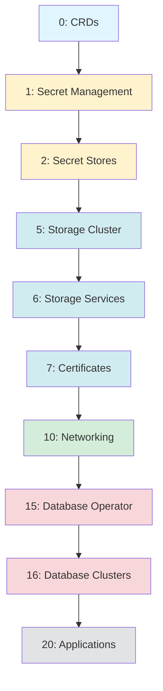

# Talos Cluster Applications

This directory contains ArgoCD Application definitions for the Talos Kubernetes cluster, organized by deployment dependencies and sync-waves.

## File Organization

Applications are organized into separate files based on their dependencies and deployment order. Each file corresponds to a specific sync-wave, ensuring proper sequencing during cluster bootstrap and upgrades.

```
clusters/talos/apps/
├── common-values.yaml              # Shared configuration for all applications
├── 00-crds.yaml                    # Custom Resource Definitions (wave 0)
├── 01-secret-management.yaml       # Secret management infrastructure (wave 1)
├── 02-secret-stores.yaml           # Secret store configuration (wave 2)
├── 05-storage.yaml                 # Storage cluster (wave 5)
├── 06-storage-services.yaml        # Storage-related services (wave 6)
├── 07-certificates.yaml            # Certificate management (wave 7)
├── 10-networking.yaml              # Network infrastructure (wave 10)
├── 15-database-operator.yaml       # Database operator & backup (wave 15)
├── 16-database-clusters.yaml       # Database cluster instances (wave 16)
└── 20-applications.yaml            # User-facing applications (wave 20)
```

## Dependency Chain

The deployment follows a strict dependency hierarchy to ensure all prerequisites are met before dependent services start:

### Phase 1: Foundation (Waves 0-2)
**Secrets Management** - Establish secret infrastructure before any other services

```
0️⃣  CRDs
    └── envoy-gateway-crds
         ↓
1️⃣  Secret Management
    ├── external-secrets-chart
    └── onepassword-connect
         ↓
2️⃣  Secret Stores
    └── external-secrets-stores
```

### Phase 2: Infrastructure (Waves 5-10)
**Storage & Networking** - Deploy core infrastructure components

```
5️⃣  Storage (Rook Ceph)
    ├── rook-ceph
    └── rook-ceph-cluster
         ↓
6️⃣  Storage Services
    ├── snapshot-controller
    ├── kopia (backup storage)
    └── volsync (volume replication)
         ↓
7️⃣  Certificates
    └── cert-manager
         ↓
🔟 Networking
    ├── cilium (CNI)
    ├── coredns
    ├── spegel (registry mirror)
    ├── envoy-gateway
    ├── envoy-gateway-config
    ├── unifi-dns
    └── cloudflare-dns
```

### Phase 3: Data Layer (Waves 15-16)
**Databases** - Deploy database infrastructure and instances

```
1️⃣5️⃣ Database Operator & Backup
    ├── cloudnative-pg (PostgreSQL operator)
    └── barman-cloud (PostgreSQL backup)
         ↓
1️⃣6️⃣ Database Clusters
    └── cloudnative-cluster (PostgreSQL instance)
```

### Phase 4: Applications (Wave 20)
**Platform Services** - Deploy user-facing applications

```
2️⃣0️⃣ Applications
    ├── cloudflare-tunnel
    ├── argo-cd
    ├── homepage
    ├── system-upgrade-controller
    └── kubechecks
```

## Deployment Flow



## Key Dependencies

### 1. Secrets Management (Waves 1-2)
All subsequent applications may require secrets for authentication, API keys, or sensitive configuration. This must be established first.

**Components:**
- External Secrets Operator
- 1Password Connect
- Secret Store configurations

### 2. Storage (Waves 5-7)
Databases and stateful applications require persistent storage. Storage infrastructure must be ready before database deployment.

**Components:**
- Rook Ceph distributed storage
- Volume snapshots for backups
- Kopia for backup repositories
- Volsync for volume replication
- Cert Manager (may store certificates persistently)

### 3. Database (Waves 15-16)
Applications often depend on databases for persistent data. Databases require storage to be operational first.

**Components:**
- CloudNative-PG operator
- Barman Cloud for PostgreSQL backups
- PostgreSQL cluster instances

## Sync-Wave Strategy

Sync-waves control the order of ArgoCD application deployment:

- **Wave 0**: CRDs required by other applications
- **Wave 1-2**: Secret management infrastructure
- **Wave 5-7**: Storage and certificate infrastructure
- **Wave 10**: Network infrastructure and CNI
- **Wave 15-16**: Database operators and instances
- **Wave 20**: User-facing applications

## Adding New Applications

When adding new applications, consider their dependencies:

### Requires Secrets Only
Add to `20-applications.yaml` with sync-wave 20

### Requires Storage
Add to `20-applications.yaml` with sync-wave 20 (storage is ready at wave 5)

### Requires Database
Add to `20-applications.yaml` with sync-wave 20 or higher (database is ready at wave 16)

### New Database Instance
Add to `16-database-clusters.yaml` with sync-wave 16

### Storage-Related Service
Add to `06-storage-services.yaml` with sync-wave 6

## Troubleshooting

If applications fail to deploy, check dependencies in order:

1. **Application fails** → Check if database is ready (wave 16)
2. **Database fails** → Check if storage is ready (wave 5)
3. **Storage fails** → Check if secrets are ready (wave 1-2)
4. **Secrets fail** → Check if CRDs are installed (wave 0)

Use this command to check sync status:
```bash
kubectl get applications -n argo-system -o custom-columns=NAME:.metadata.name,SYNC:.status.sync.status,HEALTH:.status.health.status,WAVE:.metadata.annotations."argocd\.argoproj\.io/sync-wave"
```

## Benefits of This Structure

✅ **Dependency Management** - Applications deploy only after prerequisites are ready
✅ **Predictable Ordering** - Clear, documented deployment sequence
✅ **Easy Troubleshooting** - Follow the dependency chain to find root causes
✅ **Scalability** - Easy to add new applications in the correct wave
✅ **Self-Documenting** - File names clearly indicate purpose and order
✅ **Isolated Failures** - Problems in one layer don't affect earlier layers

## References

- [ArgoCD Sync Waves](https://argo-cd.readthedocs.io/en/stable/user-guide/sync-waves/)
- [Rook Ceph](https://rook.io/docs/rook/latest/)
- [CloudNative-PG](https://cloudnative-pg.io/)
- [External Secrets Operator](https://external-secrets.io/)
