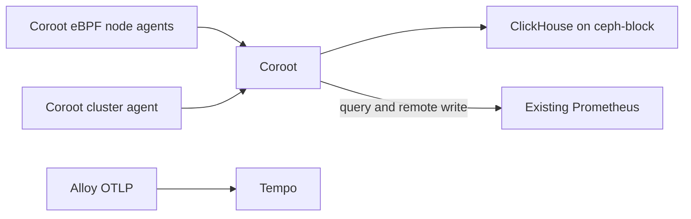

# Coroot Observability Design

## Goal

Deploy Coroot Community Edition in the `observability` namespace as a complementary investigation interface. Reuse the existing Prometheus server for metrics, retain Grafana Tempo as the destination for application OTLP traces, and collect Coroot-native telemetry with its eBPF agents.

## Scope

Included:

- Coroot operator and `Coroot` custom resource.
- Coroot UI exposed through the existing Gateway API.
- Coroot eBPF node agent and cluster agent.
- Existing Prometheus as Coroot's external Prometheus endpoint and remote-write receiver.
- Coroot-managed ClickHouse and ClickHouse Keeper backed by `ceph-block` PVCs.

Excluded:

- A second Prometheus instance.
- Garage S3 storage for ClickHouse.
- Alloy OTLP fan-out to Coroot.
- Duplicating Forge or Hermes application traces into Coroot.
- Changes to existing Grafana, Loki, Tempo, or application instrumentation.

## Architecture

Coroot will consume and write metrics through the existing Prometheus instance. Prometheus must enable its remote-write receiver before the Coroot custom resource is applied.

Coroot's node agent observes request flows through eBPF. Existing OTLP traces continue through Alloy to Tempo and are intentionally unavailable in Coroot. Adding them later requires a second Alloy OTLP exporter to Coroot's gRPC receiver and is outside this design.

Coroot-owned trace, log, profile, and cache data resides in its ClickHouse deployment. ClickHouse and ClickHouse Keeper use Rook-Ceph block PVCs. Garage is not part of the data path.

## GitOps Layout and Ordering

Create two ArgoCD applications in `clusters/talos/apps/25-observability.yaml`:

1. `coroot-operator` at sync wave `23` installs the CRD and controller.
2. `coroot` at sync wave `24` applies the `Coroot` custom resource only after its CRD exists.

Both deploy to `observability`.

`components/observability/coroot-operator/` uses the maintained Coroot operator Helm chart with a version pin and CRD installation enabled.

`components/observability/coroot/` remains intentionally small:

- `kustomization.yaml` references the custom resource and HTTPRoute.
- `coroot.yaml` configures external Prometheus, Ceph-backed ClickHouse and Keeper, retention, and resource requirements.
- `http-route.yaml` follows the repository's standard HTTPS Gateway API pattern.

Do not use the `coroot-ce` Helm chart: it only renders a `Coroot` custom resource, so a direct resource avoids a redundant chart layer.

## Configuration Contract

### Prometheus

The existing `kube-prometheus-stack` remains the sole metric server.

- Set `prometheus.prometheusSpec.enableRemoteWriteReceiver: true`.
- Configure Coroot `externalPrometheus.url` with the cluster-local Prometheus URL.
- Configure Coroot `externalPrometheus.remoteWriteURL` with the same Prometheus remote-write receiver endpoint.
- Preserve the current Prometheus retention and storage settings initially. Monitor capacity after Coroot begins writing its own metrics.

### ClickHouse

Coroot creates its own ClickHouse and Keeper.

- Use `ceph-block` for all persistent volumes.
- Set explicit resource requests and memory limits for Coroot, ClickHouse, Keeper, cluster agent, and node agent.
- Set explicit Coroot trace, log, profile, and cache retention before first sync.
- Do not configure S3 disks or Garage. Sizing must account for all retained Coroot data on Ceph.

### Traces

- Coroot uses eBPF-derived request telemetry only.
- Alloy continues to export application OTLP traces only to Tempo.
- Forge and Hermes remain unchanged and are Tempo-only in the first deployment.

## Security

Coroot's eBPF node agent is privileged and observes host and workload activity. Limit privileged access to the operator-generated node-agent daemonset. Existing application workload security contexts must remain unchanged.

No secret is required for the initial Community Edition deployment. Use an ExternalSecret if a future Coroot configuration requires credentials.

## Verification

1. Render and validate the operator and Coroot manifests.
2. Sync the operator and confirm its CRD and controller are ready.
3. Sync the Coroot custom resource and confirm the `Coroot` status is healthy.
4. Confirm Coroot's node agent and cluster agent are ready on their intended nodes.
5. Confirm Coroot can query Prometheus and that Prometheus accepts Coroot remote writes.
6. Confirm the Coroot service map contains eBPF-observed traffic.
7. Confirm Forge and Hermes traces remain queryable in Tempo. Their absence from Coroot is expected by design.

## Deferred Change

If a real investigation requires existing application OTLP spans in Coroot, add a second Alloy OTLP exporter to Coroot's gRPC receiver. This will duplicate trace ingestion and ClickHouse storage, so it requires a separate capacity decision.